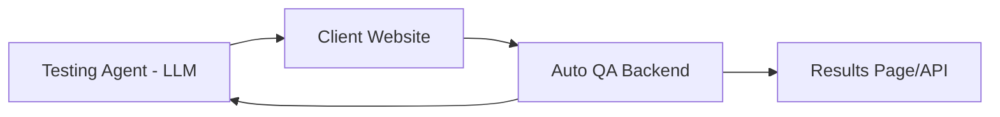

# AutoQA

## Overview
This repository is a project that aims to automate QA testing using LLMs

## Architecture


Flow:
1. Client Website is ready for QA testing
2. User specifies QA instructions to test website (can be defined ahead of time)
3. Instructions are converted sent to LLM and converted into instructions for tester agent to interact with website 
4. Tester agent interacts with website and records results

## Tech Stack
- Python
- Flask


## Installation
1. Clone repository:
```
git clone https://github.com/mike2151/AutoQA.git
```

2. Navigate to repository and set up/activate virtual environment:
```
cd AutoQA ; python -m venv venv ; source venv/bin/activate
```

3. Install dependencies:
```
pip install -r requirements.txt
```

4. Run Web App:
```
python src/web_backend/app.py
```