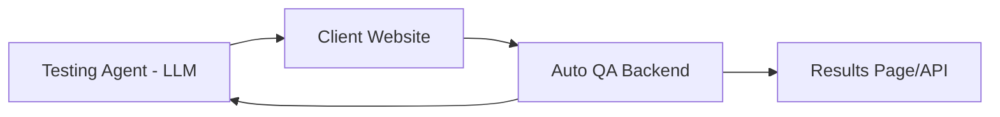
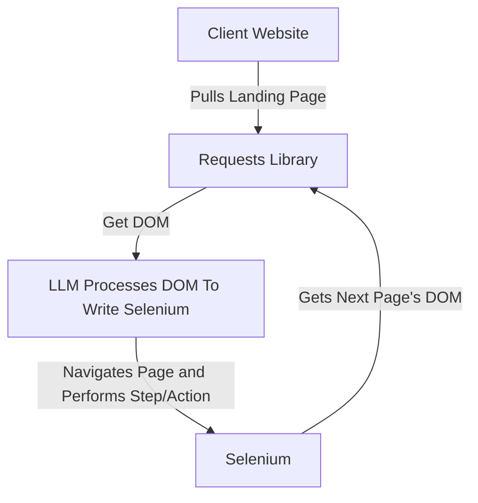

# AutoQA

## Overview
This repository is a project that aims to automate QA testing using LLMs

## Architecture


Flow:
1. Client Website is ready for QA testing
2. User specifies QA instructions to test website (can be defined ahead of time)
3. Instructions are converted sent to LLM and converted into instructions for tester agent to interact with website 
4. Tester agent interacts with website and records results

## Tech Stack
- Python
- Flask
- Open AI API for Chat GPT 3.5
- SQLite (mostly for job tracking)

## Installation
0. You will need to have a web driver installed (Chrome should do if you have already)
1. Clone repository:
```
git clone https://github.com/mike2151/AutoQA.git
```

2. Navigate to repository and set up/activate virtual environment:
```
cd AutoQA ; python -m venv venv ; source venv/bin/activate
```

3. Install dependencies:
```
pip install -r requirements.txt
```

4. Run Web App:
```
invoke run
```

## Usage
1. After running the web app (see previous section), navigate to [http://127.0.0.1:5000](http://127.0.0.1:5000)
2. Enter instructions and a URL and click "Submit"
3. You will then be brought to the job status page where you can see the status of your job by refreshing. There will be additional information about the job once it is complete such as screenshots of the QA (wait for the completed status)

## How Does The "Tester"/QA Work
There are two main flows to consider:
1. The given page is the extent of the QA
2. The given page is a "landing page" and the QA needs to navigate to other pages

The current branch only supports the first flow. The second flow will be added in the future.

In general though, this is how the QA will progress (for the first flow, just stop the recursive cycle at the given page):



## Testing
You can run unit/integration tests with:
```
invoke test
```