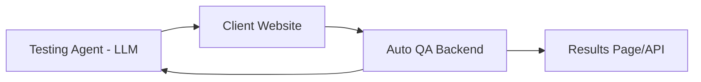

# AutoQA

## Overview
This repository is a project that aims to automate QA testing using LLMs

## Architecture

```mermaid
%% (Diagram made using https://mermaid.live/)
graph LR
    A[Testing Agent - LLM] --> B[Client Website]
    B --> C[Auto QA Backend]
    C --> A
    C --> D[Results  Page/API]
```
